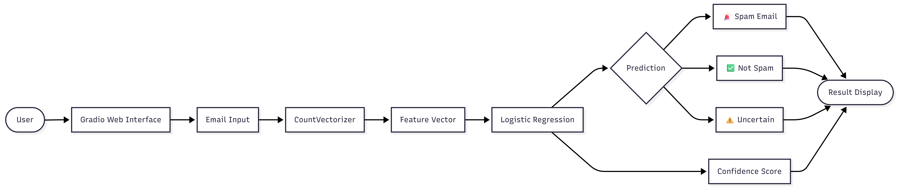
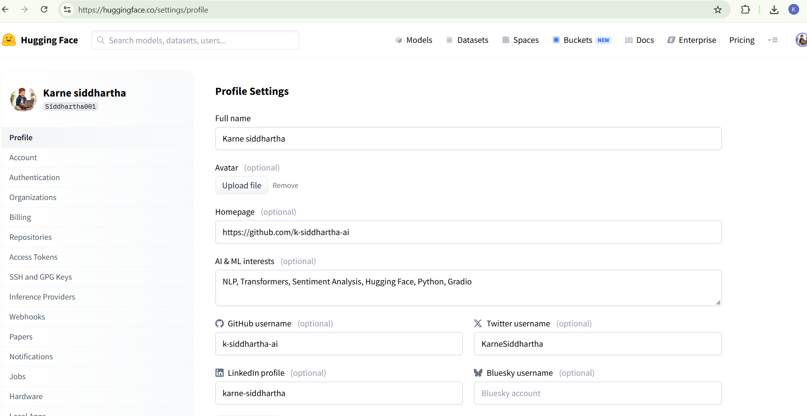
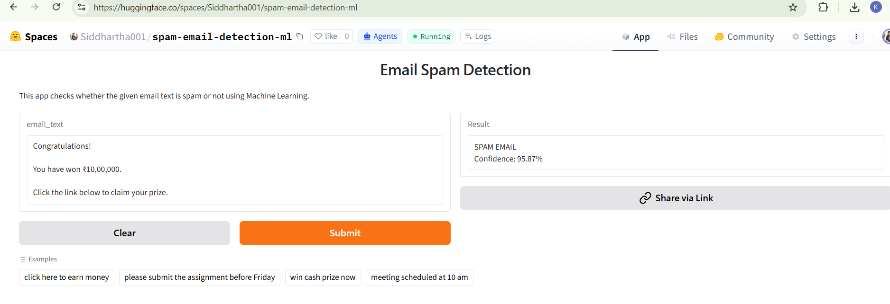
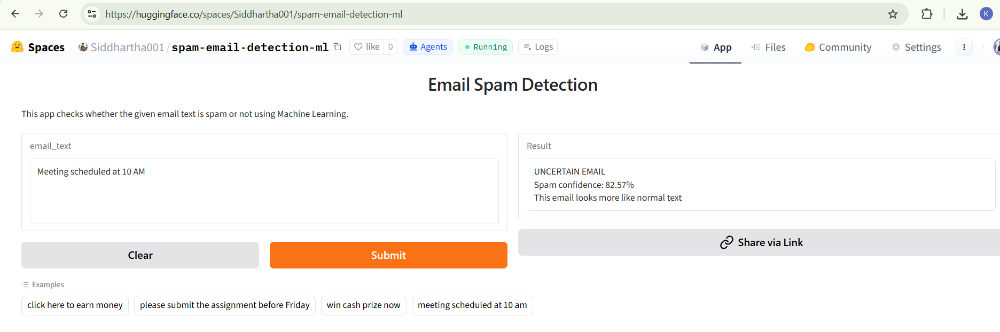
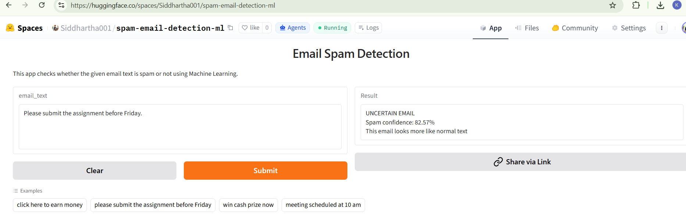

<h1 align="center">📧 Spam Email Detection using Machine Learning</h1>

<p align="center">
A Machine Learning application that classifies email messages as <b>Spam</b>, <b>Not Spam</b>, or <b>Uncertain</b> using <b>Logistic Regression</b> and <b>CountVectorizer</b>.
</p>

<p align="center">


</p>

---

# 🚀 Live Demo

🌐 **Try the application here:**

👉 **https://huggingface.co/spaces/Siddhartha001/spam-email-detection-ml**

---

# 📌 Project Overview

Spam emails are one of the most common cybersecurity threats, often containing phishing links, fake prizes, malicious attachments, or financial scams.

This project demonstrates how Machine Learning can automatically classify email messages into:

- 🚨 **Spam Email**
- ✅ **Not Spam Email**
- ⚠️ **Uncertain Email**

Instead of forcing an incorrect prediction, the application returns an **Uncertain** result whenever the model confidence falls within a predefined range.

The application is built using **Python**, **Scikit-Learn**, **Gradio**, and deployed on **Hugging Face Spaces** for real-time predictions.

---

# 🌟 Project Highlights

- 🚀 Developed a real-time **Spam Email Detection** web application.
- 🧠 Built using **Machine Learning (Logistic Regression)**.
- 📝 Applied **Natural Language Processing (NLP)** using **CountVectorizer**.
- 📊 Displays prediction confidence for every email.
- ⚠️ Returns an **Uncertain** prediction for low-confidence classifications.
- 🌐 Successfully deployed on **Hugging Face Spaces**.
- 🎯 Designed a simple and beginner-friendly user interface using **Gradio**.

---

# 🏗️ System Architecture

The following diagram illustrates the complete workflow of the Spam Email Detection system.

<p align="center">
        
</p>

---

# 🖥️ Application Preview

## 🏠 Home Screen

The main interface where users can enter an email message and receive a prediction.

<p align="center">
  
</p>

---

## 🚨 Spam Email Prediction

Example showing a spam email detected with a high confidence score.

<p align="center">
  
</p>

---

## ⚠️ Uncertain Email Prediction

If the confidence falls within the predefined threshold, the application returns an **Uncertain** result instead of forcing an incorrect prediction.

<p align="center">
  
</p>

---

## ✅ Not Spam Email Prediction

Example of a legitimate email classified as **Not Spam**.

<p align="center">
  
</p>


---

# ✨ Key Features

- 🚨 Real-time Spam Email Detection
- 🧠 Machine Learning based Classification
- 📝 Natural Language Processing using CountVectorizer
- 📊 Prediction Confidence Score
- ⚠️ Uncertain Prediction for Low Confidence
- 🌐 Interactive Gradio Web Interface
- ☁️ Deployed on Hugging Face Spaces
- 📱 Simple and Responsive User Interface
- 🔍 Easy-to-use Email Testing Interface

---

# ⚙️ Workflow

```text
                User
                  │
                  ▼
        Gradio Web Interface
                  │
                  ▼
            Email Input
                  │
                  ▼
         Text Preprocessing
                  │
                  ▼
          CountVectorizer
                  │
                  ▼
          Feature Vector
                  │
                  ▼
      Logistic Regression Model
                  │
                  ▼
     Prediction + Confidence Score
          │        │         │
          │        │         │
          ▼        ▼         ▼
      🚨 Spam   ✅ Not Spam  ⚠️ Uncertain
                  │
                  ▼
           Display Prediction
```

---

# 🛠️ Technology Stack

| Category | Technology |
|-----------|------------|
| Programming Language | Python |
| Machine Learning | Scikit-Learn |
| Algorithm | Logistic Regression |
| Natural Language Processing | CountVectorizer |
| Numerical Computing | NumPy |
| Model Serialization | Joblib |
| Web Framework | Gradio |
| Deployment | Hugging Face Spaces |
| Version Control | Git & GitHub |

---

# 📂 Project Structure

```text
spam-email-detection-ml
│
├── app.py
├── main.py
├── spam_model.pkl
├── vectorizer.pkl
├── requirements.txt
├── README.md
├── .gitignore
│
└── images
    ├── architecture-diagram.png
    ├── home.png
    ├── spam_prediction.png
    ├── uncertain_prediction.png
    └── normal_prediction.png
```

---

# 📊 Sample Predictions

| Email Message | Prediction |
|---------------|------------|
| Click here to earn money | 🚨 Spam Email |
| Congratulations! You won ₹10,00,000 | 🚨 Spam Email |
| Meeting scheduled at 10 AM | ⚠️ Uncertain |
| Please submit your assignment before Friday | ✅ Not Spam |

---

# 🚀 Installation

## 1️⃣ Clone the Repository

```bash
git clone https://github.com/k-siddhartha-ai/spam-email-detection-ml.git
```

## 2️⃣ Navigate to the Project Folder

```bash
cd spam-email-detection-ml
```

## 3️⃣ Install Required Packages

```bash
pip install -r requirements.txt
```

## 4️⃣ Run the Application

```bash
python app.py
```

The application will start locally, and you can open it in your browser.

---

# 🎯 Future Enhancements

- 📈 Train the model using a larger real-world email dataset.
- 🧠 Improve prediction accuracy using advanced NLP techniques.
- 🤖 Explore Deep Learning models (LSTM/BERT).
- 🌐 Develop a REST API using FastAPI.
- 🐳 Add Docker support for easy deployment.
- 🔒 Detect phishing URLs and suspicious email attachments.
- ☁️ Deploy on cloud platforms such as AWS, Azure, or GCP.
- 🔄 Implement CI/CD for automated testing and deployment.
- 📊 Add an analytics dashboard for monitoring predictions.
